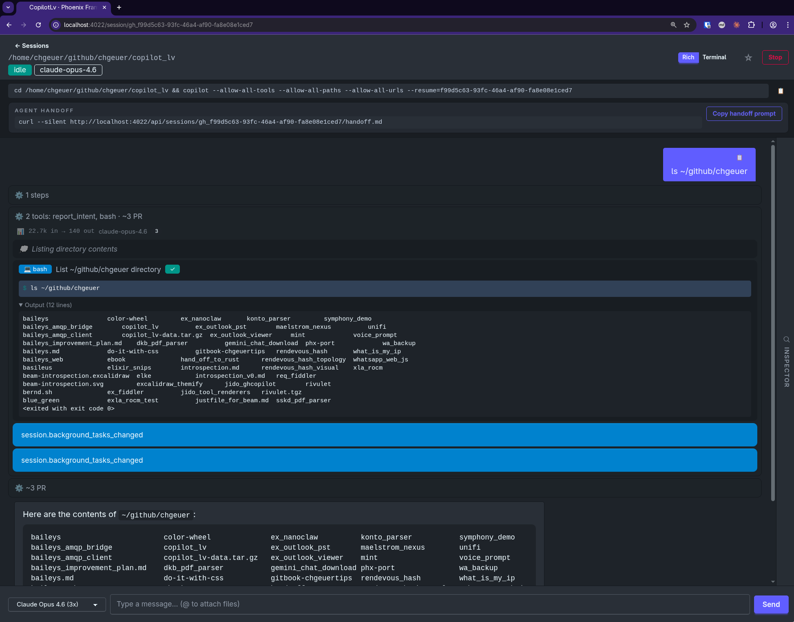

# Copilot LV

A Phoenix LiveView dashboard for running, browsing, searching, and exporting AI coding agent sessions.

Supports sessions from **GitHub Copilot**, **Claude Code**, **OpenAI Codex**, and **Gemini CLI** — all in one unified interface.



## Features

- **Multi-agent support** — Browse sessions from Copilot, Claude, Codex, and Gemini side-by-side
- **Live sync** — Watches for new sessions on disk and imports them automatically
- **Session timeline** — View the full conversation with tool calls, file changes, and thinking blocks
- **Search & filter** — Filter by agent, model, branch, date range, or free-text search
- **Markdown export** — Export sessions as markdown for handoff or archival
- **Usage tracking** — Token usage, cost estimates, and quota data per session
- **Starred sessions** — Bookmark important sessions for quick access

## Requirements

- Elixir `~> 1.15`
- Node.js (for asset compilation)
- At least one supported CLI agent installed and authenticated:
  - [GitHub Copilot CLI](https://docs.github.com/en/copilot/using-github-copilot/using-github-copilot-in-the-command-line)
  - [Claude Code](https://docs.anthropic.com/en/docs/claude-code)
  - [OpenAI Codex CLI](https://github.com/openai/codex)
  - [Gemini CLI](https://github.com/google-gemini/gemini-cli)

## Getting Started

```bash
# Install dependencies
mix setup

# Start the server
mix phx.server
```

Then visit [`localhost:4000`](http://localhost:4000) in your browser.

## Data Model

Sessions are stored in a local SQLite database (`copilot_lv.db`) using the [Ash Framework](https://ash-hq.org/). See [DATA_MODEL.md](DATA_MODEL.md) for the full schema reference.

## License

Apache-2.0 — see [LICENSE](LICENSE) for details.
